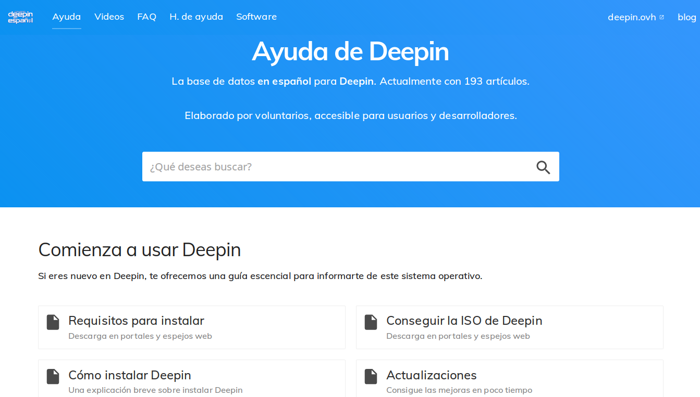

# Deepin en acción

Deepin en acción (en nombre clave "Basedata") es una colección de información relevante sobre el sistema operativo. Está desarrollado por Deepin en Español.

**Deepin en acción** está diseñada con el tema Base [CloudCannon](http://cloudcannon.com/) ([información](https://learn.cloudcannon.com/jekyll-templates/) y [documentación](https://learn.cloudcannon.com/)).

## Lo que contiene

* Acciones básicas de Deepin
* Tutoriales
* Y más...

## Desarrollo

Base está construído sobre [Jekyll](http://jekyllrb.com/) versión 3.4.3, con soporte para nuevas actualizaciones.

Puedes instalar el servidor con [Bundler](http://bundler.io/):

~~~bash
$ bundle install
~~~

Ejecuta los comandos `jekyll`:

~~~bash
$ bundle exec jekyll serve
~~~

## Editing

Base is already optimised for adding, updating and removing tutorials, navigation, footer and FAQ information in CloudCannon.

The sticky sidebar in tutorials in populated by pulling out `<h2>` elements from the content.

### Posts

* Add, update or remove a post in the *Posts* collection.
* The tutorials page is organised by categories.
* Change the defaults when new posts are created in `_posts/_defaults.md`.

### Post Series
To create a new series:

* Add a new document to the `sets` collection.
* Set the `title` and `description`.

To add a tutorial/post to a series:
* Add a `set` field to the tutorial front matter which points to the file name of the desired set without the `.md` extention. e.g. If I have a set at `_sets/getting-started.md` I would use this in my tutorial front matter: `set: getting-started`.
* Add a `set_order` field to the tutorial front matter and specify a number. This is the tutorials order in the set.

### Navegación

* Exposed as a data file to give clients better access.
* Set in the *Data* / *Navigation* section.

### Pie

* Exposed as a data file to give clients better access.
* Set in the *Data* / *Footer* section.

### Licencia

Licenciado bajo Creative Commons Atribution Share-Alkine 4.0.

### Agradecimientos

* [SVGOMG](https://jakearchibald.github.io/svgomg/) para comprimir imagenes
* [Simpleicons](https://simpleicons.org/icons/telegram.svg) para el logo de Telegram
